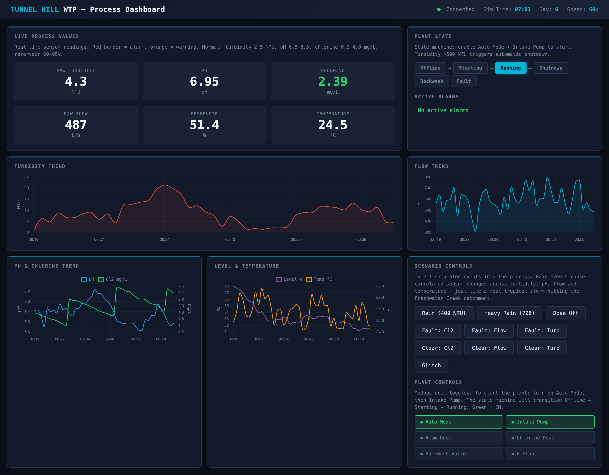
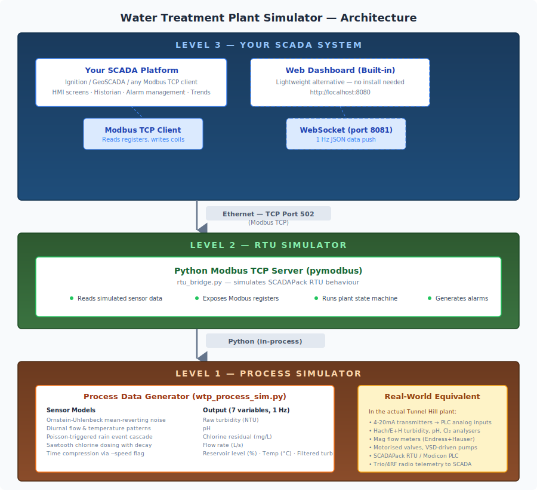
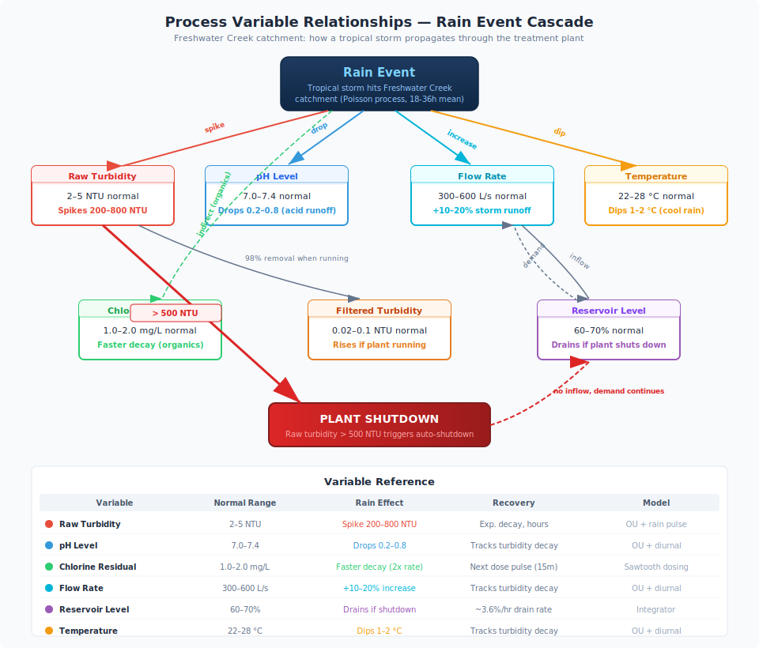
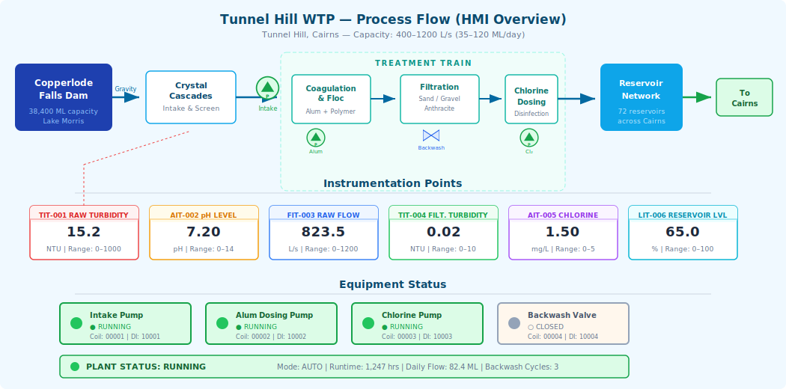

# Water Treatment Plant Simulator


> Realistic process data over Modbus TCP — build and test your own SCADA system against a working water treatment model. No hardware required.



## What Is This?

A realistic water treatment plant simulator that exposes 7 correlated process variables as standard **Modbus TCP registers** — the same protocol used by real PLCs and RTUs in industrial plants. You connect your own SCADA system (Ignition, GeoSCADA, or anything that speaks Modbus TCP) and build HMIs, historians, and alarm pipelines against data that behaves like a real plant.

The simulator is modelled on the **Tunnel Hill Water Treatment Plant** in Cairns, Queensland, which treats water from Copperlode Falls Dam for 165,000+ residents. The data, thresholds, and behaviours are grounded in a real plant — not made up.

All seven process variables are physically correlated — when a tropical rain event hits the Freshwater Creek catchment, turbidity spikes, pH drops from acidic runoff, flow increases from storm water, temperature dips, and chlorine residual decays faster as organics consume it. If raw turbidity exceeds 500 NTU, the plant automatically shuts down — exactly as the real Tunnel Hill plant behaves during wet season.

A lightweight web dashboard is included for quick visualisation, but the real value is the Modbus TCP interface — plug in your own SCADA platform and start building.

**Useful for:** SCADA development, Ignition training, learning industrial protocols, control systems interview prep.

## Quick Start

```bash
pip install pymodbus websockets

python rtu_bridge.py --speed 60 --modbus-port 5020
```

Open **http://localhost:8080** in your browser. At `--speed 60`, one wall-second equals one simulated minute — you'll see a full 24-hour cycle in 24 minutes with rain events firing automatically.

## Features

- **Realistic correlated sensor data** — Ornstein-Uhlenbeck mean-reverting random walks, not simple sine waves
- **Rain event cascade** — tropical storms affect all sensors simultaneously with physically accurate correlations
- **Automatic turbidity shutdown** — plant shuts down at >500 NTU, reservoir drains while offline (real Tunnel Hill behaviour)
- **Diurnal patterns** — flow follows morning/afternoon demand peaks, temperature tracks daily heating/cooling
- **Sawtooth chlorine dosing** — periodic dose pulses with exponential decay between doses
- **Full Modbus TCP register map** — holding registers, coils, discrete inputs, input registers with standard 16-bit integer scaling
- **Plant state machine** — Offline → Starting → Running → Shutdown, with Backwash and Fault branches
- **Live web dashboard** — gauges, rolling time-series charts, alarm panel, equipment controls, scenario injection
- **Interactive scenario control** — trigger rain events, equipment faults, data glitches from dashboard or terminal

## Architecture

<p align="center">
  
</p>

The simulator mirrors a real three-layer industrial architecture:

**Level 3 — Your SCADA System:** This is where you come in. Connect Ignition, GeoSCADA, or any Modbus TCP client and build your own HMI screens, historian, alarm management, and trend displays. The built-in web dashboard serves as a lightweight alternative for quick visualisation.

**Level 2 — RTU/PLC Simulator:** The Python RTU bridge (`rtu_bridge.py`) acts as a SCADAPack RTU. It reads sensor data, runs the plant state machine, generates alarms, and exposes everything as Modbus TCP registers.

**Level 1 — Process Simulator:** The process data generator (`wtp_process_sim.py`) produces 7 correlated sensor values using Ornstein-Uhlenbeck random walks, diurnal patterns, and rain event cascades.

## Process Variable Relationships

<p align="center">
  
</p>

All process variables are interconnected. A rain event is the primary external driver that cascades through the entire system:

| Variable | Normal Range | Rain Effect | Recovery |
|----------|-------------|-------------|----------|
| **Raw Turbidity** | 2–5 NTU | Spikes 200–800 NTU | Exponential decay over hours |
| **pH** | 7.0–7.4 | Drops 0.2–0.8 (acidic runoff) | Tracks turbidity decay |
| **Chlorine Residual** | 1.0–2.0 mg/L | Faster decay (organics consume Cl₂) | Next dose pulse (~15 min) |
| **Flow Rate** | 300–600 L/s | +10–20% storm runoff | Tracks turbidity decay |
| **Reservoir Level** | 60–70% | Drains if plant shuts down | ~3.6%/hr drain rate with no inflow |
| **Temperature** | 22–28 °C | Dips 1–2 °C (cooler rain) | Tracks turbidity decay |
| **Filtered Turbidity** | 0.02–0.1 NTU | Rises proportionally | 98% removal when running |

### The Rain Event Cascade

1. A tropical storm hits the Freshwater Creek catchment (Poisson process, mean interval 18–36 simulated hours)
2. **Turbidity spikes** sharply as sediment washes into the creek — rises over ~10% of event duration, then exponential decay
3. **pH drops** as acidic tropical runoff enters the intake — proportional to turbidity severity
4. **Flow increases** 10–20% from storm water volume
5. **Temperature dips** 1–2 °C from cooler rainwater mixing
6. **Chlorine decays faster** as dissolved organics consume the residual at 2× the normal rate
7. If turbidity exceeds **500 NTU**, the plant **automatically shuts down** — intake stops, no water enters the reservoir
8. **Reservoir level drains** — consumers keep drawing water but nothing comes in. At 500 L/s demand, the reservoir drops ~3.6% per hour
9. Once turbidity clears below threshold, operators can restart the plant and the reservoir refills

## Process Flow

<p align="center">
  
</p>

## Dashboard


The web dashboard runs as a single HTML file with Chart.js (loaded via CDN) and connects to a WebSocket for 1 Hz data updates. No build tools, no npm.

- **Live gauges** for all six process variables with colour-coded alarm states (red border = alarm, orange = warning)
- **Rolling time-series charts** — turbidity, flow, pH/chlorine, and level/temperature
- **Plant state machine** display with the current state highlighted
- **Active alarms panel** decoded from the Modbus alarm word bitfield
- **Scenario controls** — trigger rain events (400 or 700 NTU), equipment faults, dosing failures, data glitches
- **Plant controls** — toggle Modbus coils: auto mode, intake pump, dosing pumps, backwash valve, emergency stop

## CLI Reference

```
python rtu_bridge.py [OPTIONS]
```

| Option | Default | Description |
|--------|---------|-------------|
| `--modbus-port` | 502 | Modbus TCP port. Use 5020 to avoid needing sudo. |
| `--speed` | 1.0 | Time compression factor. `60` = one simulated minute per wall-second. |
| `--seed` | None | Random seed for reproducible runs. |
| `--no-auto-events` | off | Disable automatic rain events (manual trigger only). |
| `--dashboard-port` | 8080 | HTTP port for web dashboard. WebSocket runs on port+1. |

### Example Commands

```bash
# Quick demo — 60x speed, reproducible seed, rain events every few minutes
python rtu_bridge.py --speed 60 --seed 42 --modbus-port 5020

# Real-time speed (slow — hours between rain events)
python rtu_bridge.py --modbus-port 5020

# Manual scenario control only (no automatic rain)
python rtu_bridge.py --speed 60 --no-auto-events --modbus-port 5020

# Custom dashboard port
python rtu_bridge.py --speed 60 --modbus-port 5020 --dashboard-port 9000
```

## Interactive Commands

When running in simulation mode, type commands into the terminal:

| Command | Example | Effect |
|---------|---------|--------|
| `rain [ntu]` | `rain 600` | Trigger rain event with given peak turbidity (default 400) |
| `dose off` | | Stop chlorine dosing (simulates pump failure) |
| `dose on` | | Resume chlorine dosing |
| `fault <sensor>` | `fault chlorine` | Force sensor into fault state (`chlorine`, `flow`, `turbidity`) |
| `clear <sensor>` | `clear chlorine` | Clear a sensor fault |
| `glitch` | | Random data corruption for 30 simulated seconds |
| `status` | | Print current simulation state |
| `help` | | List commands |

These same actions are available as buttons on the web dashboard.

## Connecting to Ignition SCADA

The simulator exposes standard Modbus TCP registers that any SCADA system can read. To connect Ignition:

1. Start the bridge: `python rtu_bridge.py --speed 60 --modbus-port 5020`
2. In Ignition Designer, create a **Modbus TCP** device pointing to `localhost:5020`, Unit ID 1
3. Configure tags using the register map in [`register_map.md`](register_map.md)
4. Apply scaling factors (e.g. turbidity register value ÷ 10 = NTU)

For a detailed walkthrough, see the [Ignition Setup Guide](ignition_setup_guide.md).

Ignition and the web dashboard can run simultaneously — they both read from the same Modbus registers.

## Documentation

| Document | Description |
|----------|-------------|
| [`register_map.md`](register_map.md) | Complete Modbus register map — addresses, scaling, alarm bit definitions |
| [`water_treatment_guide.md`](water_treatment_guide.md) | How water treatment works — from catchment to tap |
| [`ignition_setup_guide.md`](ignition_setup_guide.md) | Step-by-step Ignition SCADA connection guide |

## Learn About Water Treatment

This simulator models a real treatment process: coagulation with alum, flocculation, sand/anthracite filtration, and chlorine disinfection. The [`water_treatment_guide.md`](water_treatment_guide.md) explains each treatment stage, why these specific measurements matter, and how operators respond to events like tropical storms flooding the catchment.

## Project Structure

| File | Description |
|------|-------------|
| `rtu_bridge.py` | Main entry point — RTU bridge with Modbus TCP server, plant state machine, threading |
| `wtp_process_sim.py` | Realistic process data generator — OU random walks, diurnal patterns, rain events |
| `dashboard.py` | Web dashboard server — HTTP + WebSocket for live data push |
| `dashboard.html` | Single-file dashboard UI — Chart.js via CDN, no build tools |
| `register_map.md` | Modbus register map with addresses, scaling factors, alarm bit definitions |
| `water_treatment_guide.md` | Educational guide to water treatment processes |
| `ignition_setup_guide.md` | Ignition SCADA connection walkthrough |
| `docs/` | SVGs, screenshots, and diagrams |

## Requirements

- **Python 3.8+**
- [`pymodbus`](https://pypi.org/project/pymodbus/) — Modbus TCP server
- [`websockets`](https://pypi.org/project/websockets/) — Dashboard WebSocket server

## License

[MIT](LICENSE)
